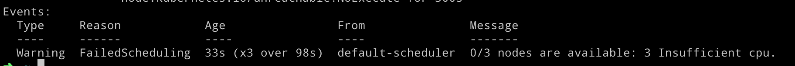

# Kubernetes Autoscaler for AWS

## Purpose Statement
When you run a production kubernetes cluster, you want to scale your worker nodes automatically. Sometimes, a pod stays in pending status and when you check it, you realize that, there is no enough resource for this pod to become healthy.

In this article, we are going to use cluster-autoscaler to scale our worker nodes when it needs. Before that, you should have a running kubernetes cluster on AWS or just read to increase your knowledge. Who knows, maybe a day you need to implement it and remember this article. 

You can also follow this address.
https://github.com/kubernetes/autoscaler/blob/master/cluster-autoscaler/cloudprovider/aws/README.md

## Prerequisites
In my kubernetes cluster, I have a master and 2 worker nodes. There is a nginx-ingress controller (it creates an ELB as you know!). Both 2 nodes are under this ELB.


Also, I have a jenkins in the jenkins namespace and 3 jobs in it. These are pipeline jobs (Jenkinsfiles, pipeline as code) and 1. job triggers 2. job and then 2. job triggers the 3th one.

As I said before, I have 2 worker nodes. Firstly, I did not install the cluster-autoscaler. I want to show you, there will be a pod which stay in "pending" status and then we will check it to see the reason (insufficient resource).

Then, I'm going to install the cluster-autoscaler and when i trace the autoscaler pod, I will see that, it will detect a "pending" pod and it will add a new node to the cluster. In addition to that, when the new node becomes ready, it will be added under the ELB automatically.

## Let's Start!
1. There are 3 jobs. Their duties are not related with this article.

* service-brand-master (1. job)
* docker-builder-pusher (2. job)
* k8s-deployer (3. job)


2. I'm going to click the 1. job (service-brand-master). Then I will check the pods under the jenkins namespace. If the jenkins slave pod reaches the "running" status, it's ok. At the end of the 1. job, it will trigger the 2nd one.
As you see, a jenkins slave pod for the 1st job is "running", everything is ok!


3. service-brand has triggered the docker-builder-pusher but there is a problem! The new jenkins slave pod for this operation stayed in "pending" status.


When we describe the pod to understand what is going inside it, we will see the reason. Aha moment! There is no enough CPU in the cluster. So, the pod never reaches the "running" status.

```
kubectl describe po default-0qf98 -n jenkins
```


If I go on, I have to add new nodes to the cluster. But it is a manual operation, there must be another way!

## Cluster Autoscaler

**1. Cleaning …**

* First of all, I will stop the running jobs and return the beginning. Now, I have only 1 running pod (jenkins master)


**2. Add Policies to Your Cluster**

* I run this command to add some policies.

```
kops edit cluster --name=YOUR_CLUSTER_NAME --state=s3://YOUR_S3_PATH
```

* This command will open a text editor. In this page, I added these policies.

```
additionalPolicies:
    node: |
      [
        {
          "Effect": "Allow",
          "Action": [
            "autoscaling:DescribeAutoScalingGroups",
            "autoscaling:DescribeAutoScalingInstances",
            "autoscaling:SetDesiredCapacity",
            "autoscaling:DescribeLaunchConfigurations",
            "autoscaling:DescribeTags",
            "autoscaling:TerminateInstanceInAutoScalingGroup"
          ],
          "Resource": ["*"]
        }
      ]
```


**3. Add Cloud Labels to nodes IG**

* I run this command to add some cloud labels.

```
kops edit ig nodes --name=YOUR_CLUSTER_NAME --state=s3://YOUR_S3_PATH --yes
```

* This command will open a text editor. In this page, I added these labels.

```
cloudLabels:
    k8s.io/cluster-autoscaler/enabled: ""
    k8s.io/cluster-autoscaler/node-template/label: ""
    kubernetes.io/cluster/kubernetes.softbased.com: owned
``` 


* Then, update the cluster,

```
kops update cluster --name=YOUR_CLUSTER_NAME --state=s3://YOUR_S3_PATH --yes
```

**4. Autoscaler values yaml**

* This file is `autoscaler-values.yaml` and under this repo.

* When I run this, my cluster autoscaler will be ready. Before this, you should change these values !!!

* ->YOUR_CLUSTER_NAME

* ->YOUR_REGION

* -> VERSION

```
helm install --name autoscaler --namespace kube-system -f autoscaler-values.yaml stable/cluster-autoscaler
```

* I need to check it.

```
kubectl --namespace=kube-system get pods -l "app=aws-cluster-autoscaler,release=autoscaler"
```
* I should see this picture


**5. Try again!**

* In the beginning of the article, I mentioned that my cluster has 2 nodes and when I started the jenkins pipeline jobs, 2nd job could not start because of the lack of resources.

* Then, I install the cluster autoscaler and it is time to start my jenkins pipeline jobs. 

* I expect that, 2nd job will not find a enough resource to start and than autoscaler will detect this problem (pending pod) and create a new node. When node becomes ready, it will be added under the ELB automatically.

* There is only one running pod right now (jenkins master)


**6. Start 1st job**

* I'm starting the 1st job. As you see, there is a new jenkins slave pod for this job. For this job, there is enough space, so, nothing will change.


* As you see, there are still 2 nodes in the ELB.


**7. Autoscaler is scaling up !**

* When the 1st job completed, it triggered the 2nd one.

* When the 2nd job completed, it triggered the 3nd one.

* Because autoscaler has created new nodes, when it has detected a "pending" pods.

* For example, now, under my ELB, there are 5 nodes. There were 2 nodes but it has expanded to 5 nodes automatically.


* There are autoscaler pod logs, I can easily see that, autoscaler has detected the necessity of resource and solved it.


 
* My pipeline jobs has been completed. 

* Now, I will wait 10 minutes and then autoscaler will terminate some nodes. Because load will decrease and autoscaler will detect that my cluster does not need 5 nodes, 2 nodes are enough!

**7. Autoscaler is scaling down !**


* At the end of the period, there are 2 nodes in my cluster.


## Conclusion
That's all. Automating your cluster is an important DevOps practice and cluster-autoscaler is a good tool to do that.